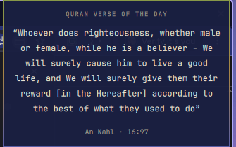

# Quran Verse of the Day

A quiet daily Quran verse in the [Omarchy](https://omarchy.org) bar.



A small book icon sits in the bar. Click it and a minimal popup shows one
verse — English translation, surah name, ayah number. Read it in a few
seconds and get back to work.

- **Offline.** The complete English translation is bundled. No network request
  is ever made — the plugin works with WiFi, ethernet, and VPN all off.
- **Theme-aware.** It uses the active Omarchy theme's colors and fonts. Change
  your theme and the popup follows. It has no colors of its own.
- **Deterministic.** A given day always shows the same verse. Opening the popup
  again shows the same verse. The next day is different.
- **Contextual.** The verse isn't random. Simple local signals — the day part,
  Friday, the start or end of the month — nudge the selection toward a fitting
  theme (patience, gratitude, reflection, mercy, …). No AI, no telemetry.
- **Light.** No timers beyond one hourly date check, no background process, no
  polling. The 1.2 MB verse dataset is parsed at most once per day, and not at
  all on a day whose verse is already cached.

English translation: **Saheeh International**, redistributed from
[risan/quran-json](https://github.com/risan/quran-json) under CC-BY-SA 4.0.
See [ATTRIBUTION.md](ATTRIBUTION.md).

---

## Installation

```sh
omarchy plugin add https://github.com/imargorsi/QuranVerse.git --enable
```

Omarchy warns you that plugins run as unsandboxed code in the shell, shows you
the URL, and asks you to confirm. It clones the repo into
`~/.config/omarchy/plugins/io.github.imargorsi.quran-verse/` and enables it. The
icon appears in the right section of the bar; move it with:

```sh
omarchy bar move io.github.imargorsi.quran-verse --section left
```

### By hand

```sh
git clone https://github.com/imargorsi/QuranVerse.git \
  ~/.config/omarchy/plugins/io.github.imargorsi.quran-verse
omarchy-shell shell rescanPlugins
omarchy plugin enable io.github.imargorsi.quran-verse
```

## Updating

```sh
omarchy plugin update io.github.imargorsi.quran-verse
```

Omarchy shows the diff, fast-forwards the checkout, and re-validates. A verse
data refresh (see [docs/DATA.md](docs/DATA.md)) arrives the same way.

## Uninstallation

```sh
omarchy plugin disable io.github.imargorsi.quran-verse
omarchy plugin remove io.github.imargorsi.quran-verse
```

This removes the plugin directory and its bar-layout entry in `shell.json`.
Nothing else in your Omarchy config is touched. One tiny state file records
today's verse and a short recent-verse history; delete it if you want:

```sh
rm ~/.local/state/omarchy/quran-verse.json
```

## Development

The plugin is a directory of plain files — no build step for the QML.

| File | Role |
|------|------|
| `manifest.json` | Plugin metadata; declares the `bar-widget` and its entry point |
| `Panel.qml` | Bar icon + popup. All layout, typography, theme colors |
| `Service.qml` | Headless: date, context, deterministic pick, data + cache I/O |
| `Selection.js` | Pure selection logic (no QML) — unit-tested with node |
| `verse-themes.json` | Curated theme → verse map, and context → theme map |
| `quran.json` | The full English translation, keyed `"surah:ayah"` (generated) |
| `quran_en.json` | Upstream source data; `quran.json` is built from it |

Edit any file under `~/.config/omarchy/plugins/` and the shell hot-reloads it.
A symlink checkout is the convenient loop:

```sh
ln -s "$PWD" ~/.config/omarchy/plugins/io.github.imargorsi.quran-verse
omarchy-shell shell rescanPlugins
```

Regenerate the dataset after changing `quran_en.json`:

```sh
python3 tools/build-quran-json.py
```

More detail: [docs/ARCHITECTURE.md](docs/ARCHITECTURE.md),
[docs/CONTEXT-SELECTION.md](docs/CONTEXT-SELECTION.md), [docs/DATA.md](docs/DATA.md).

## Testing

```sh
omarchy plugin validate .          # manifest + entry points + no symlinks
qmllint -I "$OMARCHY_PATH/shell" Panel.qml Service.qml
python3 tools/verify-references.py  # every curated reference exists in quran.json
node    tools/test-selection.cjs    # determinism, context mapping, integrity
```

Then, in the running shell:

| Check | How | Expect |
|-------|-----|--------|
| Loads | enable the plugin | book icon appears in the bar |
| Popup | click the icon | popup opens; `Esc` or click-away closes it |
| Daily consistency | open, close, open | identical verse |
| Date change | `date -s tomorrow`, reopen (then set it back) | a different verse |
| Offline | disable all networking, reopen | verse still shows |
| Theme | `omarchy theme next` | popup recolors to match |
| Long verses | wait for a long one (e.g. a `hardship` day) | wraps, no overflow, scrolls if needed |
| Performance | `top -p "$(pgrep -f omarchy-shell)"` | no continuous CPU use, no network |

`qmllint` reports `Unexpected token 'void'` on the typed IPC handler functions
(`function open(): void`). That is a known limitation of the standalone linter —
Quickshell requires that syntax and the shell runs it fine; `omarchy plugin
validate` passes.

## Troubleshooting

**The icon doesn't appear.** `omarchy plugin list | grep quran` — if it's not
listed, run `omarchy-shell shell rescanPlugins`. If listed but disabled,
`omarchy plugin enable io.github.imargorsi.quran-verse`. Check the shell log
with `journalctl --user -n 100 | grep -i quran`.

**The popup says "Unable to load Quran data."** `quran.json` or
`verse-themes.json` is missing or corrupt in the plugin directory. Reinstall or
re-run `python3 tools/build-quran-json.py`.

**The verse never changes.** It changes once per local day. To force a
recompute now, delete the cache: `rm ~/.local/state/omarchy/quran-verse.json`
and reopen the popup.

**Wrong font or colors.** The plugin reads `bar.foreground`, `bar.fontFamily`,
and the `qs.Ui` popup surface, so it matches whatever the active theme sets. If
it looks off, your theme's `shell.toml` popup section is what to look at, not
this plugin.

## Scope

V1 is intentionally small: English only, one verse, minimal popup. Not included:
Arabic, audio, tafsir, search, bookmarks, settings UI, notifications, a Hijri
calendar. The code is structured so those can be added later without a rewrite —
see [docs/ARCHITECTURE.md](docs/ARCHITECTURE.md#future).

## License

Code: **MIT** ([LICENSE](LICENSE)). Bundled Quran data: **CC-BY-SA 4.0**
([LICENSE-DATA.txt](LICENSE-DATA.txt), [ATTRIBUTION.md](ATTRIBUTION.md)).
